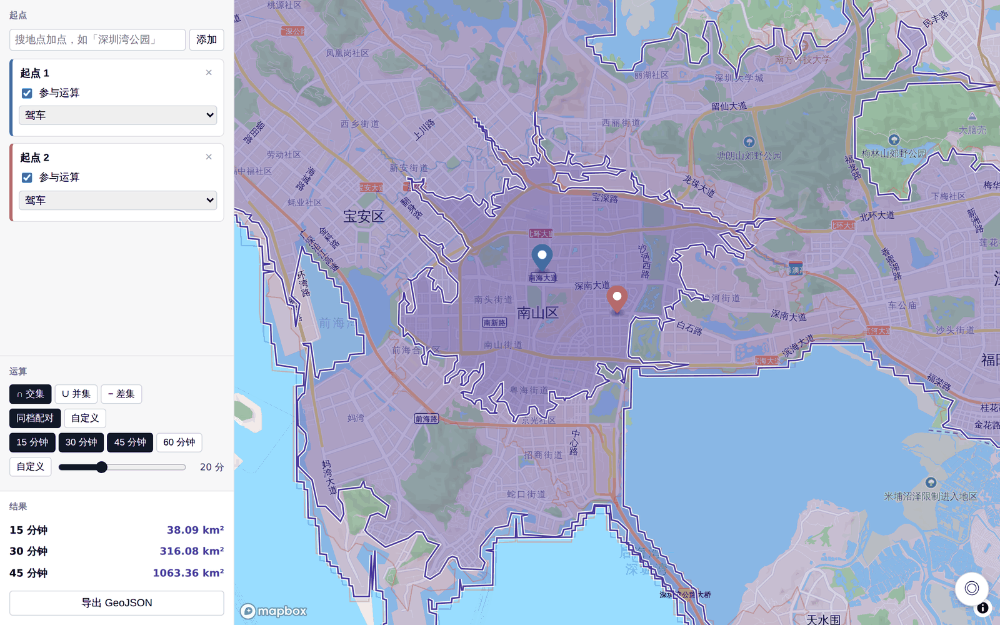
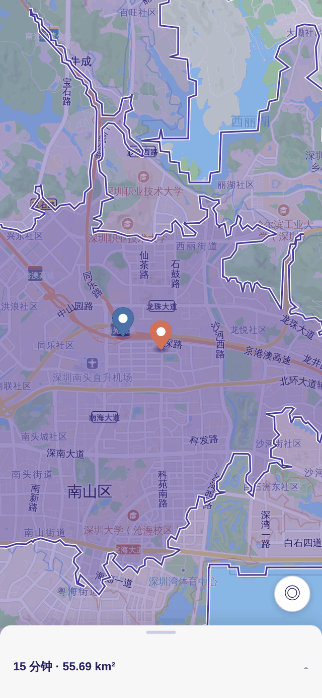

# 🗺️ 等时圈 · 多点可达性交集

**「我们俩 30 分钟内都能到的地方在哪？」** 在地图上标几个起点，答案直接画给你看。

**👉 打开就能用：https://raymond1030.github.io/Accessibility-Map/**

不用注册、不用安装，手机电脑都行。

    

长这样 👇 深圳南山两个起点，15 / 30 / 45 分钟驾车都能到的区域层层嵌套：

---

## 💡 它能帮你回答什么

- ☕ **约在哪碰头？** 标上双方位置，看看 30 分钟内都能到的地方
- 🏪 **门店覆盖了哪里？** 几家店的服务范围加起来长什么样
- 🚗 **哪里只有我能到？** A 能到、B 到不了的区域一目了然

每个起点还能单独选出行方式：**驾车 / 驾车（实时路况）/ 步行 / 骑行**——你开车、朋友走路，完全没问题。

## 🚀 怎么用

1. **加起点** —— 点一下地图，或搜地名，或点右下角 ◎ 定位到自己
2. **选出行方式** —— 每个点可以不一样
3. **选运算和时间** —— 交集（都能到）、并集（合起来）、差集（只有某点能到），1–60 分钟随便拖
4. **看结果** —— 彩色区域就是答案，左下角有面积，还能导出 GeoJSON

### ⏱️ 时间怎么选

- **同档配对** —— 大家用同一组时间（比如 15 / 30 / 45 分钟），一眼看到层层嵌套的区域，适合「我们多快能碰头」
- **自定义** —— 每个点单独设时间，比如「A 的 15 分钟 ∩ B 的 45 分钟」，适合一方赶路更辛苦的情况

差集要指定一个基准点，结果是「基准点能到、其他点都到不了」的地盘。

### 📱 手机上用

地图全屏，控件收在底部抽屉里，点顶部把手就能展开收起。抽屉收着的时候，结果摘要也一直看得见（右图底部那行「15 分钟 · 55.69 km²」就是）。

手机上加点要先点「**＋ 在地图上加点**」再点地图落点——不然拖个地图就误加一个点，那可太烦了。电脑上直接点地图就行。

 

## 🔍 怎么读结果

**「无共同可达区」不是出 bug 了！** 两个离得很远的点，15 分钟内确实碰不了头——这就是工具想告诉你的结论。想找到共同区域？把时间调大试试。

其他几种提示：

| 提示 | 意思 |
|---|---|
| 🤝 无共同可达区 | 这个时长内真的没交集，调大时间再试 |
| 🌊 周边无可达数据 | 点落在水里或没路的地方了，挪一挪 |
| ⚠️ 数据不全，无法计算 | 某个点数据没取到，会告诉你缺哪个，可以单独重试 |

宁可说「算不了」，也不会拿残缺的数据给你一个看着正常、其实是错的结果。

## 📋 使用前须知

- 🚌 **暂不支持公共交通**，目前只有驾车 / 步行 / 骑行
- 🐢 **国内首次打开要等几秒**（数据来自境外服务），之后就快了；个别地名可能显示英文
- 🗂️ **导出的 GeoJSON 是标准 WGS-84 坐标**，QGIS 等工具直接打开就能用

---

## 🛠️ 开发者

想本地运行、了解架构设计或参与开发？请看 [开发文档](docs/DEVELOPMENT.md)。

React 18 · TypeScript · Mapbox GL JS · Turf.js —— 116 个单元测试全部通过 ✅

基于 [MIT 协议](LICENSE)开源。
